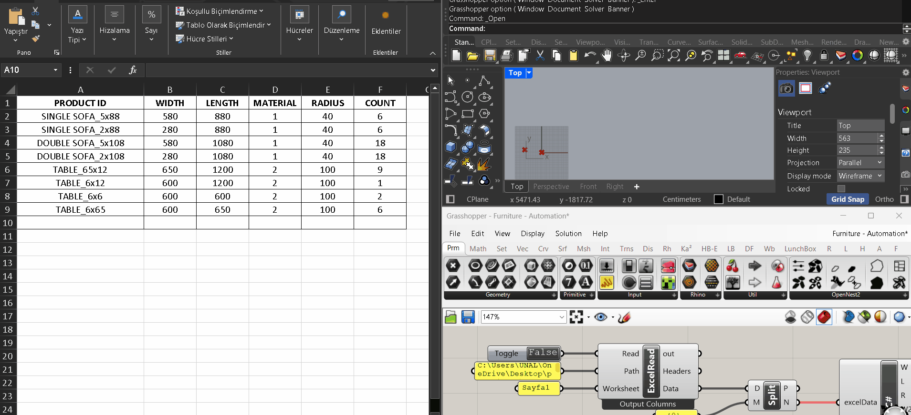

# Nesting Data Integration
> Automated wooden panel nesting system driven by Excel data and C# in Grasshopper.



## 📌 Overview
This project automates wooden panel nesting by processing and parsing layout data from an Excel file using custom C# scripts in Grasshopper. The algorithm dynamically calculates piece dimensions and optimizes their placement on standard-sized sheet materials within seconds to minimize waste. Because the workflow is fully parametric, any updates to the source Excel file instantly trigger a re-nesting process, dynamically re-arranging and re-packing the parts.

---

## 🔑 Key Features
* **Data Integration:** Parses part dimensions and quantities directly from Excel via custom C# components.
* **Material Optimization:** Calculates nesting layouts on standard sheets to drastically reduce material waste.
* **Dynamic Workflow:** Automatically recalculates and updates Rhino geometry whenever source data changes.

---

## 🛠️ Repository Structure
```text
nesting_data_integration/
├── data/              # Sample Excel input templates
├── docs/              # GIF 
├── models/            # Rhino context models (.3dm)
└── src/               # Grasshopper definitions (.gh) & C# scripts (.cs)
